# REST API Berita – Laravel

REST API ini digunakan untuk manajemen **Authentication**, **Post**, dan **Comment**.  
Dokumentasi ini dilengkapi dengan contoh request menggunakan Postman beserta screenshot.

---

## 🚀 Fitur Utama
- 🔐 Authentication (Register, Login, me, Logout)
- 📰 Post (List, Detail, Create, Update, Delete)
- 💬 Comment (Create, Update, Delete)

---

# 🔐 AUTHENTICATION

## 1. Register  
**POST** `/register`  
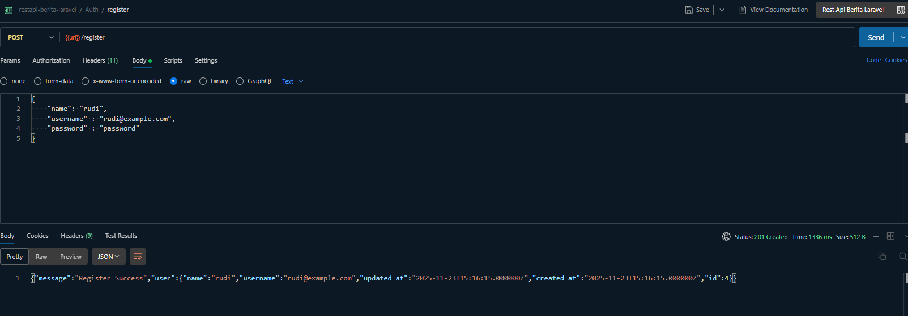

---

## 2. Login  
**POST** `/login`  
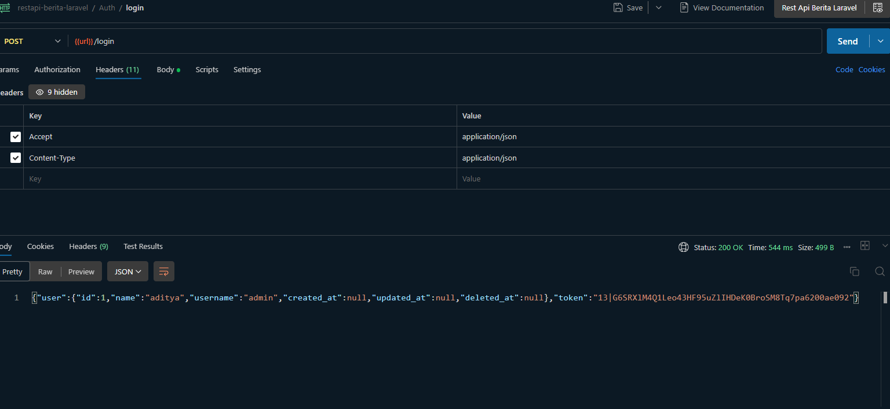

---

## 3. Logout  
**GET** `/logout`  
Header: `Authorization: Bearer <token>`  
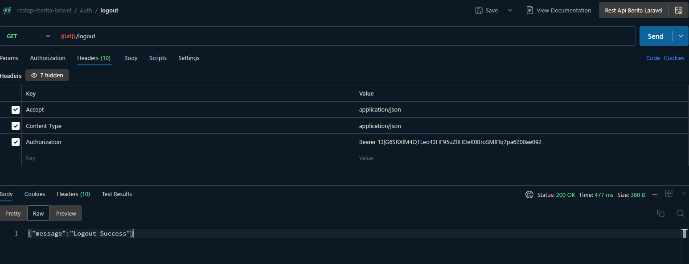

---

# 📰 POST

## 1. Get All Posts  
**GET** `/posts`  
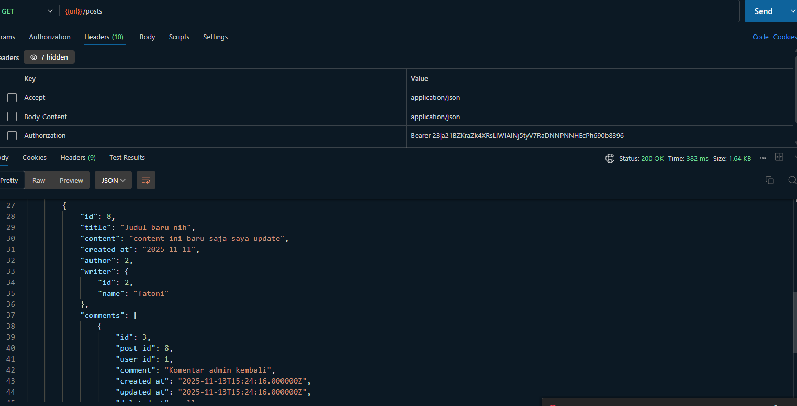

---

## 2. Create Post  
**POST** `/posts`  
Body (multipart form-data):  
- title  
- content  
- image *(optional)*  
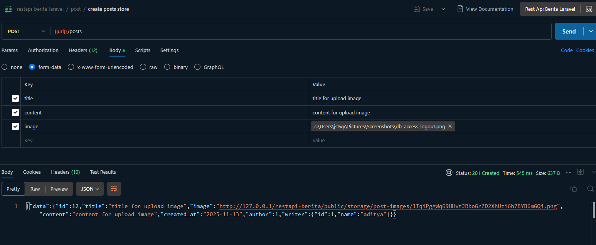

---

# 💬 COMMENT

## 1. Create Comment  
**POST** `/comments`  
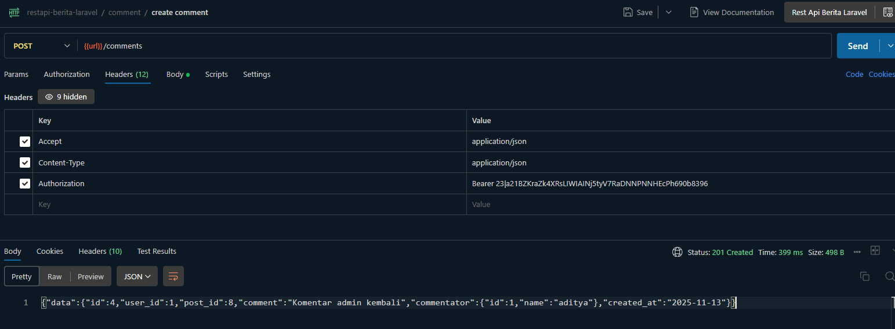

---

## 2. Delete Comment  
**DELETE** `/comments/{id}`  
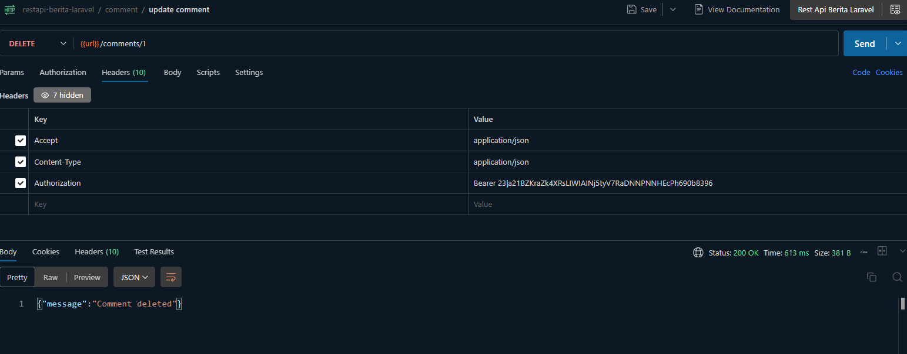

---

# 📝 Catatan
- Semua endpoint yang membutuhkan login wajib menggunakan header. Butki diatas hanya beberapa karena seringnya melakukan pembaruan setiap melakukan endpoint

---

## 📌 Tampilan Frontend

| Halaman | Screenshot |
|--------|------------|
| Home | 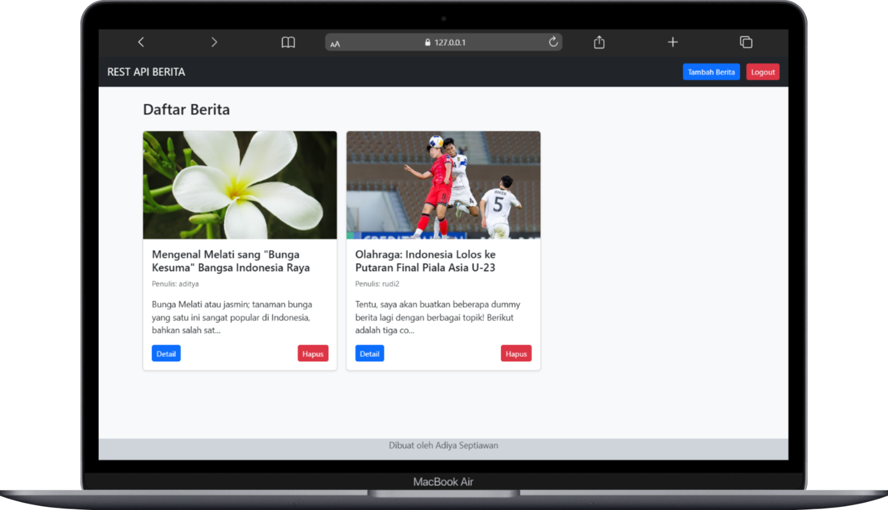 |
| Detail Berita | 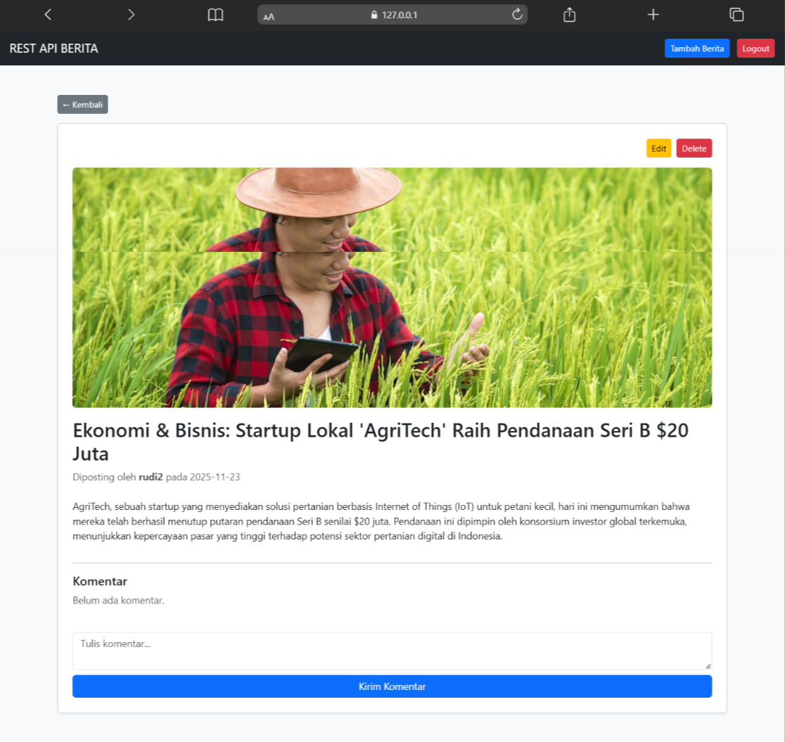 |
| Komentar |  |
| Login | 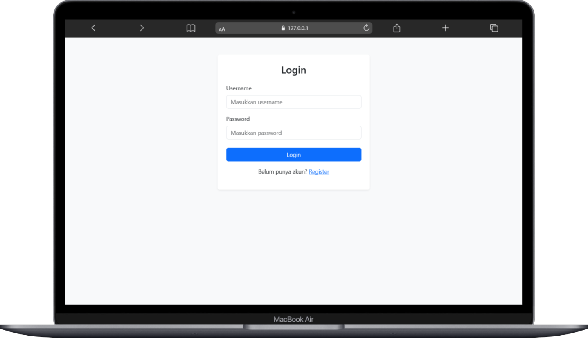 |
| Register | 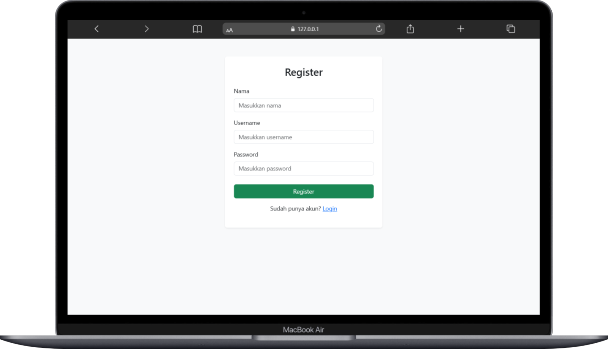 |

---
## 📝 Catatan
- Tabel di atas hanya menampilkan beberapa tampilan FE. Pada akses Home bisa dilihat tanpa harus login tapi masih belom bisa berkomentar seperti anonymous
- Komentar bisa edit hapus cuma kalau login sesuai users ID yang sama
